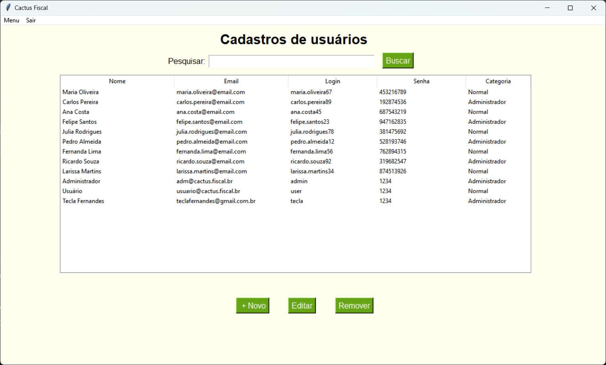
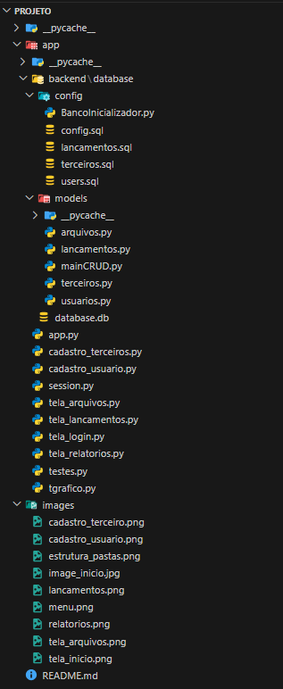

# 🌵 Cactus Fiscal - Organização e automação para a sua gestão🧾
## 📄 Propósito do projeto

**O que ele faz ?**

  O Cactus Fiscal tem como propósito organizar notas fiscais, automatizar processos manuais, gerar dashboards para visualizar gastos e diminuir erros na emissão, otimizando a gestão financeira e logística de empresas.

**Qual o problema ele pretende resolver?**

  Empresas enfrentam dificuldade em gerenciar notas fiscais e garantir conformidade fiscal, o que resulta em perdas financeiras e erros manuais. O sistema reduz o tempo e o processamento de dados a fim de aumentar a eficiência da gestão. Automatizando processos e facilitando o entendimento dos dados adquiridos. 

**Qual a motivação por trás da sua criação?**

  Uma delas foi entender o quanto a área depende desses recursos. Facilitar e resolver uma boa parte de processos que levam ao erro motivam a aumentar a eficiência e segurança na gestão empresarial, permitindo foco em decisões estratégicas. Reduzindo golpes, perdas e tarefas…


## 📌 Funcionalidades

<div style="text-align: justify;">
Principais funcionalidades do Sistema:
<div>

- **Login seguro:**
    - Login para administradores e usuários que também necessitam das funcionalidades de acordo com suas permissões.

- **Automação de processos:** 
    - Gerência notas fiscais automaticamente, reduzindo trabalho manual. Um exemplo é a implementação do lançamento de notas fiscais.

- **Análise de relatórios:** 
    - Geração de relatórios claros com gráficos. Utilizando análise de dados para uma melhor eficiência.

- **Cadastro:**
    - Cadastro de usuários para acesso ao sistema e terceiros para guardar informações clientes, fornecedores e transportadores.

- **Armazenamento de arquivos:** 
    - Possibilidade de armazenar os arquivos das notas ficais para ter acesso mais eficaz na hora da consulta.

## 🤖 Demonstração prática 

Login:

<p align="center">
    
</p>


Menu de funcionalidades:

<p align="center">
    
</p>


Cadastros:

<p align="center">
    
</p>
<p align="center">
    
</p>


Lançamentos:

<p align="center">
    
</p>


Relatórios:

<p align="center">
    
</p>


Arquivos:

<p align="center">
    
</p>

## 👾 Códigos relevantes

mainCRUD
```python
class BaseCRUD:

    def __init__(self, tabela, database='app/backend/database/database.db'): 
        self.tabela = tabela
        self.database = database
    
    # Inicia Conexão
    def _conectar(self):
        conn = sq3.connect(self.database)
        conn.execute('PRAGMA foreign_keys = OFF;')
        return conn

    # Insere Dados
    def create(self, dados_dict):
        colunas = ', '.join(dados_dict.keys())
        valores = ', '.join(['?' for i in dados_dict])
        with self._conectar() as conn:
            cursor = conn.cursor()
            cursor.execute(f'INSERT INTO {self.tabela} ({colunas}) VALUES ({valores})', tuple(dados_dict.values()))

    # Lê dados
    def read(self, info='*', filtro=None):  # Se quiser todos os dados da tabela, deixe info e filtro vazio
        comando_sql = f'SELECT {info} FROM {self.tabela} '
        if filtro:
            comando_sql += f'WHERE {filtro}'
        try:
            with self._conectar() as conn:
                cursor = conn.cursor()
                cursor.execute(comando_sql)
                retorno = cursor.fetchall()

                colunas = [desc[0] for desc in cursor.description]
                dados_formatados = [dict(zip(colunas, linha)) for linha in retorno]

                return dados_formatados
        except Exception as e:
            print(f'Erro no método read: {e}')
            return None  # Retorna lista vazia em caso de erro

    # Atualiza
    def update(self, dados_dict, filtro):
        atualizacoes = ', '.join([f'{coluna} = ?' for coluna in dados_dict])
        comando_sql = f'UPDATE {self.tabela} SET {atualizacoes} WHERE {filtro}'

        with self._conectar() as conn:
            cursor = conn.cursor()
            cursor.execute(comando_sql, tuple(dados_dict.values()))
            conn.commit()
            return cursor.rowcount
    
    # Apaga
    def delete(self, filtro):
        comando_sql = f'DELETE FROM {self.tabela} WHERE {filtro}'
        with self._conectar() as conn:
            cursor = conn.cursor()
            cursor.execute(comando_sql)
            conn.commit()

    # Comando customizado para demais tarefas
    def custom_command(self, comando, parametros=None):
        with self._conectar() as conn:
            cursor = conn.cursor()
            cursor.execute(comando, parametros or ())
        if comando.strip().upper().startswith("SELECT"):
            return cursor.fetchall()
        else:
            conn.commit()
            return None
```
Relatórios
```python
def atualizar_grafico(instance):
    # Limpa o gráfico anterior, se existir
    for widget in instance.graph_frame.winfo_children():
        widget.destroy()

    lancamentos = Lancamento()
    # Dados de cada categoria (supondo que cada método retorne uma lista de tuplas)

    saldo = lancamentos.busca_saldo()
    print(saldo)
    dados = { 
        "Entradas": lancamentos.busca_soma_entradas(),
        "Saidas": lancamentos.busca_soma_saidas(), 
        "Impostos": lancamentos.busca_soma_impostos()
    }

    print(dados['Entradas'])
    # Paleta de cores para cada categoria
    cores = ["#86cf05", "#C70039", "#FFC300"]

    # Criar figura
    fig, ax = plt.subplots(figsize=(10, 4))

    # Loop para plotar cada categoria
    for (categoria, valores), cor in zip(dados.items(), cores):

        # Converte as datas e extrai os valores
        datas = [datetime.strptime(mes + "-01", "%Y-%m-%d") for mes, _ in valores]
        montantes = [valor for _, valor in valores]
        ax.plot(datas, montantes, marker="o", linestyle=":", label=categoria, color=cor, markersize=4, linewidth=1.5)
    
    datas_ganhos = [datetime.strptime(mes + "-01", "%Y-%m-%d") for mes, _ in saldo]
    montantes_ganhos = [valor for _, valor in saldo]
    ax.plot(datas_ganhos, montantes_ganhos, marker="o", linestyle="-", label="Saldo", color="#0ca8fa", markersize=5, linewidth=1.7)

    # Configurações do gráfico
    ax.set_xlabel("Meses")
    ax.set_ylabel("Valores (R$)")
    ax.set_title("Comparação Mensal: Ganhos, Entradas, Saídas e Impostos")
    ax.legend()
    ax.grid(True, linestyle='--', linewidth=0.5)

    # Formatando datas no eixo X
    ax.xaxis.set_major_locator(mdates.MonthLocator(interval=1))
    ax.xaxis.set_major_formatter(mdates.DateFormatter("%Y-%m"))
    fig.autofmt_xdate()

    # Integrar o gráfico no frame do Tkinter
    canvas = FigureCanvasTkAgg(fig, master=instance.graph_frame)
    canvas.draw()
    canvas.get_tk_widget().pack(fill="both", expand=True)

    # Fechar a figura para não acumular memória
    plt.close(fig)

def iniciar_thread(instance):
    instance.graph_frame.after(100, atualizar_grafico, instance)
```
App
```python
import tkinter as tk
from tkinter import filedialog, messagebox
from functools import partial
from PIL import Image, ImageTk  # Para carregar e exibir a imagem
from tela_login import LoginScreen  # Importando a tela de login
from tela_lancamentos import Tela_Lancamentos  # Importando a tela Lançamentos
from tela_relatorios import Tela_Relatorios  # Importando a tela RelatoriosS
from tela_arquivos import Tela_Arquivos  # Importando a tela Arquivos
from cadastro_usuario import Cadastro_Usuario  # Importa a tela de cadastro de usuários
from cadastro_terceiros import Cadastro_Terceiros  # Importa a tela de cadastro de terceiros
from session import SessaoUsuario # Importação do Singleton

class Cactus_Fiscal:
    def __init__(self, root):
        usuario_atual = SessaoUsuario()
        dados_usuario = usuario_atual.get_usuario()

        self.window = root
        self.window.geometry(self.centralizando_tela())  
        self.window.resizable(True, True)

        # Cores
        self.color_1 = "white"  # Branco
        self.color_2 = "#ffffef"  # Bege claro
        self.color_3 = "black"  # Preto
        self.color_4 = "#67a516"  # Verde Claro
        self.color_5 = "#ff914d"  # Laranja

        # Fontes
        self.font_1 = "Helvetica"
        self.font_2 = "Times New Roman"
        self.font_3 = "trebuchet ms"
        self.font_4 = "Arial"

        # Menubar
        self.menubar = tk.Menu(self.window)

        # Menu principal
        edit = tk.Menu(self.menubar, tearoff=0)
        self.menubar.add_cascade(label='Menu', menu=edit)
        edit.add_command(label='Inicio', command=self.Home_Page)
        edit.add_separator()
        edit.add_command(label='Lançamentos', command=lambda: Tela_Lancamentos(self))
        edit.add_separator()
        edit.add_command(label='Relatórios', command=lambda: Tela_Relatorios(self))
        
        # Apenas admins poderam acessar as telas cadastros
        if dados_usuario['adm'] == 1:
            cadastros_menu = tk.Menu(edit, tearoff=0)
            edit.add_separator()
            cadastros_menu.add_command(label='Cadastro de Usuários', command=lambda: Cadastro_Usuario(self))
            cadastros_menu.add_command(label='Cadastro de Terceiros', command=lambda: Cadastro_Terceiros(self))
            edit.add_cascade(label='Cadastros', menu=cadastros_menu)
        
        edit.add_separator()
        edit.add_command(label='Arquivos', command=lambda: Tela_Arquivos(self))
        edit.add_separator()
        edit.add_command(label='Sobre', command=self.AboutWindow)
        
        # Configuração do menubar
        self.menubar.add_command(label='Sair', command=self.Exit)
        self.window.config(menu=self.menubar)

        # Criando um Frame
        self.frame_1 = tk.Frame(self.window, bg=self.color_2)
        self.frame_1.pack(fill="both", expand=True)

        self.Home_Page() 

        self.window.title('Cactus Fiscal')

    # Centralizando a janela
    def centralizando_tela(self):
        janela_largura = 1220
        janela_altura = 686
        tela_largura = self.window.winfo_screenwidth()
        tela_altura = self.window.winfo_screenheight()
        pos_x = (tela_largura // 2) - (janela_largura // 2)
        pos_y = (tela_altura // 2) - (janela_altura // 2)
        return f"{janela_largura}x{janela_altura}+{pos_x}+{pos_y}"

    # Exibindo a janela sobre com as informações do projeto
    def AboutWindow(self):
        messagebox.showinfo("Cactus Fiscal", "Cactus Fiscal\nDeveloped by Tropa 2.0")

    # Limpando a tela
    def ClearScreen(self):
        for widget in self.frame_1.winfo_children():
            widget.destroy()

    # Saindo do sistema após clicar no botão "sair"
    def Exit(self):
        if messagebox.askyesno("Confirmação", "Tem certeza que deseja sair?"):
            self.window.destroy()

    # Exibindo a tela inicial com imagem
    def Home_Page(self):
        self.ClearScreen()

        image_path = "images/image_inicio.jpg" 
        img = Image.open(image_path)
        img = img.resize((1220, 686))
        img_tk = ImageTk.PhotoImage(img)

        img_label = tk.Label(self.frame_1, image=img_tk, bg=self.color_2)
        img_label.image = img_tk
        img_label.pack(pady=1)

# Iniciando a aplicação após o login
def start_main_app():
    root.destroy()  # Fecha a tela de login
    main_root = tk.Tk()
    app = Cactus_Fiscal(main_root)
    main_root.mainloop()

if __name__ == "__main__":
    root = tk.Tk()  # Janela pra tela de login
    login = LoginScreen(root, on_login_success=start_main_app)  # Criando a tela de login
    root.mainloop()
```

## 💻 Tecnologias Utilizadas

Lista das tecnologias, frameworks e bibliotecas utilizadas no desenvolvimento do projeto.

- **Frontend**:
  - ___Python___ como linguagem escolhida;
  - Uso de ___TKinter___ para criar interfaces modernas.
  - ___Data Times___ manipulação de datas;
  - ___Message Box___ pra criação de Pop-ups dee confirmação ou erro;
  - ___TK Calendar___ calendáario de seleção;
  - ___OS___ Manitpulação de arquivos
  - ___imageTK___ Manipulação de imagens.

- **Backend**:
  - ___Python___ como linguagem para escolhida;
  - ___SQLite3___ gerenciamento do banco de dados.

- **Análise dos dados**:
  - ___Python___ como linguagem escolhida;
  - Integração com ___Matplotlib___ para exibição de gráficos;
  - ___Threading___ para atualização em tempo real das informações do gráfico.

## 📊 Desafios e Aprendizados

**Principais desafios:**

  -	Definição final do escopo do projeto;
  -	Gestão de tempo;
  -	Novas ferramentas para aprender;
  -	Garantir a conformidade com os padrões de segurança e padrões de designer.

**Aprendizados:**

  -	Trabalho em equipe;
  -	Melhoria na comunicação interpessoal;
  -	Uso de tecnologias e bibliotecas como o tkinter, Git/GitHub, matplotlib, bacno de dados, entre outras.


## 💾 Modularização

Estrutura de organização do projeto

<p align="center">
    
</p>

## 👥 Equipe

<table align="center" border="0" style="width: 100%; text-align: center; table-layout: fixed;">
  <tr>
    <td align="center" style="padding: 10px;">
      <a href="https://github.com/TeclaFernandes">
        
      </a>
      <p><strong>Tecla Fernandes</strong></p>
    </td>
    <td align="center" style="padding: 10px;">
      <a href="https://github.com/GustavoFigueiredo09">
        
      </a>
      <p><strong>Gustavo Figueiredo</strong></p>
    </td>
    <td align="center" style="padding: 10px;">
      <a href="https://github.com/Lukasoli15">
        
      </a>
      <p><strong>Lucas Oliveira</strong></p>
    </td>
    <td align="center" style="padding: 10px;">
      <a href="https://github.com/Fernando4759">
        
      </a>
      <p><strong>Fernando Barbosa</strong></p>
    </td>
  </tr>
</table>
